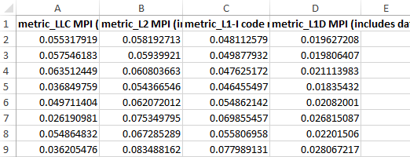
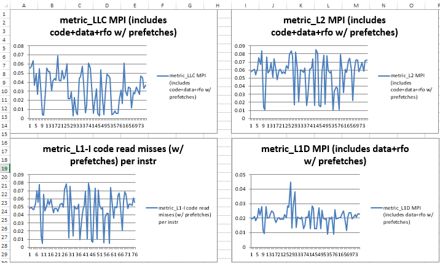
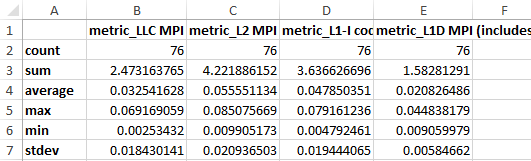

# Installation

* Pre-install `pmu-tools` by this guide https://github.com/andikleen/pmu-tools 
* Copy all files in this folder to the pmu-tools' path.

# Usage

>
>     ~# python perf_metrics.py -h
>        Usage: metrics.py [options]
>    
>     Options:
>      -h, --help            show this help message and exit
>      -s SETTING, --formula-setting=SETTING
>                            formula setting file, XML formatted
>      -m METRIC, --metric=METRIC
>                            Metric for monitor
>      -w CMD, --command=CMD
>                            Workload command default is "sleep 100"
>      -c CORES, --cores=CORES
>                            CPU affinity
>      -o OUTPUT, --output=OUTPUT
>                            Dump to a file
>      -i INTERVAL, --interval=INTERVAL
>                            Calibration interval
>

For example, if we want to show metric "CPI" on core 0,1,2 every 3 seconds, the command should be: "_python metrics.py -c 0,1,2 -m cpi -i 3_ "

# Add new metrics

- Lable &lt;metric name="metric_MYIPC">: define the metric, set a name, all name should prefixed with string “metric_”.
- Lable &lt;event alias="a">: List evenet counter name involved and declare variable name  by “alias=” to the event counter value.
- Lable &lt;formula>: formula over variables.

# Demo: Sample L1D MPI, L1I MPI, L2 MPI and LLC MPI

>	python metrics.py -m "L1D MPI (includes data+rfo w/ prefetches)","L1-I code read misses (w/ prefetches) per instr","L2 MPI (includes code+data+rfo w/ prefetches)","LLC MPI (includes code+data+rfo w/ prefetches)"

Run this command, and the tool will output a Python dictionary that contains the values of all required metrics every 1 second, like this:

>	{'metric_LLC MPI (includes code+data+rfo w/ prefetches)': 0.0018353711368199524,'metric_L2 MPI (includes code+data+rfo w/ prefetches)': 0.011707364212203336,'metric_L1-I code read misses (w/ prefetches) per instr': 0.00456501563025034,'metric_L1D MPI (includes data+rfo w/ prefetches)': 0.011540684262599205}

## Set frequency

The sample frequency can be set by argument -i. For example, in order to sample the metrics every 0.1 second, run this command:

>	python metrics.py -m "L1D MPI (includes data+rfo w/ prefetches)","L1-I code read misses (w/ prefetches) per instr","L2 MPI (includes code+data+rfo w/ prefetches)","LLC MPI (includes code+data+rfo w/ prefetches)" -i 0.1

## Output to CSV / XLSX

If you want to output the result to a CSV or XLSX file for analysis later, you should use the argument -o. If ** xlsxwriter ** is installed, then the tool will choose XLS format. Otherwise, the plain CSV formant will be selected. 

PS: It is easy to install xlsxwriter by pip:

>	pip install xlsxwriter

Run this command:

>	python metrics.py -m "L1D MPI (includes data+rfo w/ prefetches)","L1-I code read misses (w/ prefetches) per instr","L2 MPI (includes code+data+rfo w/ prefetches)","LLC MPI (includes code+data+rfo w/ prefetches)" -i 0.1 -d 10 -o cache_mpis

The argument **-d** means sampling for 10 seconds, and **-o** means outputing the result to cache_mpis.xlsx if xlsxwriter is installed, or cache_mpis.csv otherwise. The output file won't appear until the command finishes.

In the cache_mpis.xlsx, there are three sheets: data, charts and summary. The data sheet holds all the sampled raw data, 

the charts sheet holds the charts of every metric, 

and the summary sheet holds the statistics data of each metric.

# Appendix: Some common metrics

|        Name               |                   Metrics                                    |
|---------------------------|--------------------------------------------------------------|
| CPI                       | CPI                                                          |
| kernel CPI                | kernel_CPI                                                   |
| branch mispredict ratio   | branch mispredict ratio                                      |
| L1D MPI                   | L1D MPI (includes data+rfo w/ prefetches)                    |
| L1I MPI                   | L1-I code read misses (w/ prefetches) per instr              |
| L2 MPI                    | L2 MPI (includes code+data+rfo w/ prefetches)                |
| LLC MPI                   | LLC MPI (includes code+data+rfo w/ prefetches)               |
| loads per instr           | loads per instr                                              |
| stores per instr          | stores per instr                                             |
| LLC miss latency          | Average LLC data read (demand+prefetch) miss latency (in ns) |
| memory bandwidth(read)    | memory bandwidth read (MB/sec)                               |
| memory bandwidth(write)   | memory bandwidth write (MB/sec)                              |
| memory bandwidth(total)   | memory bandwidth total (MB/sec)                              |
| IO bandwidth(read)        | IO_bandwidth_disk_or_network_reads (MB/sec)                  |
| IO bandwidth(write)       | IO_bandwidth_disk_or_network_writes (MB/sec)                 |